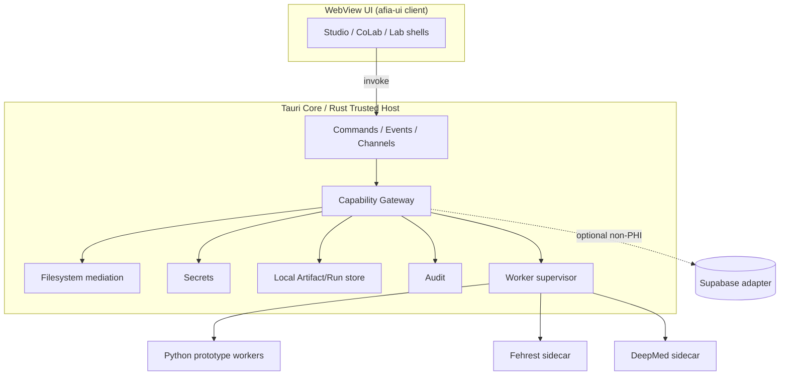
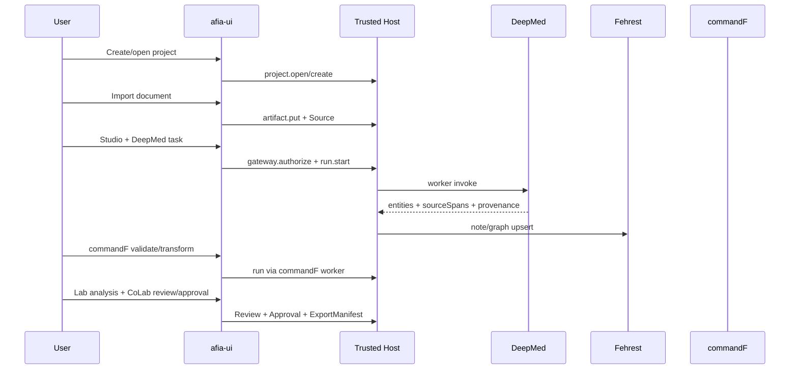

# Implementation Plan: Fanatir Repository and Architecture Reconstitution

**Branch**: `docs/f0-planning-memory-bootstrap` | **Date**: 2026-07-23 | **Spec**: [spec.md](./spec.md)

**Input**: Accepted feature specification `specs/001-fanatir-repository-and-architecture-reconstitution/spec.md`

**Note**: Planning and architecture-research only. Does **not** authorize production implementation, package rename, OpenMed/Graphify import, Fehrest/DeepMed product init beyond planning, push, or PR.

## Summary

Translate the founder-accepted reconstitution specification into a safe, staged program (R0–R5) that: freezes a verified AFIA/Fanatir baseline; ratifies architecture via sequenced ADRs including **ADR-15 Rust-first polyglot language authority**; establishes a **minimal Tauri 2 / Rust Trusted Host** early; wraps and supervises required Python (and Lab) workers without rewriting OpenMed/Graphify/Jupyter/R/scientific ecosystems in Rust; preserves `afia-ui` auth/session/`PrivateRoute`/profile behavior; moves content/PHI Artifact authority to the local Rust Artifact Store while treating Supabase as optional collab/identity adapter; defines cross-repo contracts for Fehrest and DeepMed-AI; delivers one integrated Founder Alpha golden journey within the 60-day objective; and packages a Windows-first Alpha only after signing custody controls — without big-bang rewrite or silent scope change.

## Technical Context

**Language/Version**: **Rust** (mandatory Trusted Host / kernel / policy / audit / IPC / supervision — **ADR-15**); **React/TypeScript** (UI and presentation only); **Python** (bounded workers: DeepMed/OpenMed runtime, NLP, HF, Graphify-derived, scientific); **Lab**: governed Python, R, SQL; **Go** optional only with justifying ADR — **not required for Founder Alpha**

**Primary Dependencies**: Vite/React (`afia-ui/client`), Express (`afia-ui/server` — transitional, not Trusted Host), Supabase JS client (optional identity/collab adapter), Tauri 2 + Rust host (target), supervised Python/Fehrest/DeepMed sidecars

**Storage**: **Rust-owned** local encrypted Artifact/Revision/Run store is the **authoritative** store for document content, extracted entities, patient material, FHIR containing PHI, and Artifact revisions (**founder Decision C**). Fehrest Markdown vault (knowledge). Supabase = optional collaboration/identity adapter only — not content/clinical SoT. Legacy `documents-crypto` = frozen PHI-egress seam (synthetic/test only until ADR-07/14; preserve, do not expand/delete/mutate).

**Testing**: Existing Vitest/placeholder CI (scaffold — adapt later); contract tests; IPC/process tests; PHI-egress and packaging tests (planned); worker isolation/restart tests

**Target Platform**: Desktop-first, local-first, **Windows-first** with macOS/Linux architectural support (not Windows-only)

**Project Type**: Desktop application (Tauri) + strangler web UI + multi-repo ecosystem

**Performance Goals**: Interactive Studio workflows; worker progress non-blocking via async Commands/Channels; migrate hot paths to Rust only with evidence; no unverified throughput claims

**Constraints**: Constitution v1.0.0; Spec 001 clarifications Q1–Q9; **ADR-15**; founder Decisions A–D; no PHI default cloud content SoT; no unearned compliance claims; Pictorial/Montada frozen; no OpenMed/Graphify **fork/import** in this program (PyPI runtime use for R3 DeepMed allowed per Decision B); no Rust rewrite of OpenMed/Graphify/Jupyter/R/scientific ecosystems; preserve 60-day integrated delivery objective; **no private signing keys in repo or ordinary CI variables**

**Scale/Scope**: Reconstitution + first integrated Alpha journey across Studio, DeepMed, Fehrest, CoLab (bounded), commandF, Lab, provenance, share — not full product surface

## Constitution Check

*GATE: Must pass before Phase 0 research. Re-check after Phase 1 design.*

- [x] Traceable to an accepted Spec Kit specification and this plan (Constitution II)
- [x] Does not begin from informal chat alone; acceptance criteria and verification method are defined
- [x] Respects repository boundaries (Fanatir / Fehrest / DeepMed-AI) and does not import OpenMed or Graphify without a dedicated spec
- [x] Honors product-space status (active vs frozen: Pictorial/Montada remain frozen)
- [x] Declares data classification, PHI posture, and Capability Gateway needs when models/tools/integrations are involved
- [x] Preserves Artifact/Run/provenance requirements for durable results
- [x] Keeps clinical/AI outputs assistive; no silent clinical approval or fabricated mappings
- [x] Uses ratified claim language only (no unearned HIPAA/clinical/hospital-ready claims)
- [x] Updates program memory (`CURRENT-STATE` / `NEXT-ACTION` / decisions) as part of delivery closeout

## Project Structure

### Documentation (this feature)

```text
specs/001-fanatir-repository-and-architecture-reconstitution/
├── plan.md              # This file
├── research.md          # Phase 0
├── data-model.md        # Phase 1
├── quickstart.md        # Phase 1
├── adrs/
│   └── ADR-15-rust-first-polyglot-runtime.md
├── contracts/           # Phase 1
│   ├── trusted-host-ipc.md
│   ├── worker-runtime.md
│   ├── shared-primitives.md
│   ├── fehrest-integration.md
│   ├── deepmed-integration.md
│   ├── supabase-adapter.md
│   └── commandf.md
├── checklists/requirements.md
└── spec.md
```

### Source Code (repository root — target topology; not created by this plan)

```text
Fanatir/
├── apps/desktop/                 # TARGET R2: Tauri 2 shell + Rust Trusted Host
├── afia-ui/                      # EXISTING strangler UI (client/server/shared/supabase)
│   ├── client/                   # React/Vite SPA (PrivateRoute, AuthContext)
│   ├── server/                   # Express companion
│   └── supabase/                 # Provisional Supabase app + migrations (frozen for P1)
├── packages/contracts/           # TARGET R1: language-neutral shared primitives
├── lib/                          # EXISTING TS helpers (adapt)
├── services/                     # EXISTING Python prototypes → host workers
├── supabase/migrations/          # DUPLICATE — freeze; canonicalize via separate spec
├── _archived/                    # Evidence only
├── docs/program-memory/
└── specs/

Fehrest/                          # Independent repo (empty today)
DeepMed-AI/                       # Independent repo (README-only today)
```

**Structure Decision**: Keep `afia-ui` as migration shell (UI/presentation); add `apps/desktop` **Rust** Trusted Host and `packages/contracts` without mass-renaming `afia*` identifiers (Q8). Fehrest and DeepMed remain separate remotes consumed as **Rust-supervised**, versioned process boundaries (**ADR-15**).

## Complexity Tracking

| Violation | Why Needed | Simpler Alternative Rejected Because |
|-----------|------------|-------------------------------------|
| Three repositories + desktop host | Constitution separates Fehrest/DeepMed; Q3 requires Trusted Host | Single-repo browser-only Alpha violates Q3/Q5/Q6 |
| Dual UI modes (Tauri + Vite fallback) | Strangler + auth preservation | Immediate UI rewrite risks session/`PrivateRoute` breakage (Q1) |
| Polyglot workers under Rust host | ML/science ecosystems (Python/R/SQL) required at edges | Rewriting OpenMed/Graphify/Jupyter/R stacks in Rust unauthorized and breaks 60-day objective |

---

## Founder decisions recorded (final planning)

| ID | Decision | Status |
| --- | --- | --- |
| **A** | Rust-first, polyglot-at-the-edges; ADR-15; no Rust rewrite of OpenMed/Graphify/Jupyter/R/scientific ecosystems | **Ratified** |
| **B** | R3 DeepMed may temporarily use OpenMed **PyPI** runtime (not fork/import); requirements via ADR-09 | **Ratified** |
| **C** | Content/PHI/Artifact revisions → local Rust Artifact Store; Supabase = optional collab/identity; freeze `documents-crypto`; future spec `002-supabase-local-first-and-migration-canonicalization` authorized (not created here) | **Ratified** |
| **D** | Founder is signing authority owner; R5 distribution requires full custody controls; early unsigned builds = internal/non-distributable only | **Ratified** |

---

## Planning Decision (executive)

**Staged hybrid reconstitution**: R0 baseline → R1 ADRs/contracts (**including ADR-15**) → R2 minimal Tauri/**Rust** Trusted Host (only after **ADR-15 accepted**) wrapping existing `afia-ui` and supervising Python workers → R3 golden journey (after ADR-05/07/08/09/10/14 as applicable) → R4 compatibility adapters → R5 Windows Alpha packaging **only after signing custody controls**.

**Language authority (ADR-15):** Rust-first trusted systems; React/TS = UI/presentation only; Python required for bounded ML/science workers; Lab governed Python/R/SQL; Go optional with justifying ADR and **not** required for Founder Alpha.

---

## Diagrams

### Target process / trust boundary



### Golden-journey data flow (R3)



### Cross-repository contract map

```text
Fanatir host IPC  <-->  packages/contracts (shared primitives)
Fanatir           <-->  Fehrest   (fehrest-integration.md)
Fanatir           <-->  DeepMed   (deepmed-integration.md)
Fanatir UI        <-->  Supabase  (supabase-adapter.md) [optional]
Fanatir           <-->  commandF  (commandf.md) [owned in-repo]
```

---

## ADR Roadmap

Proposed ADRs (author drafts only when workflow/tasks require). Language authority draft: [adrs/ADR-15-rust-first-polyglot-runtime.md](./adrs/ADR-15-rust-first-polyglot-runtime.md).

| ID | Title | Depends on | Acceptance gate |
| --- | --- | --- | --- |
| ADR-01 | Platform and desktop composition authority (Tauri 2) | Spec 001, Constitution, **ADR-15** | Host is sole OS authority; WebView untrusted; Core is Rust |
| ADR-02 | Trusted Host responsibility boundary | ADR-01, **ADR-15** | R2 exit criteria for minimal **Rust** host |
| ADR-03 | Existing `afia-ui` migration strategy | Q1, ADR-01 | Shell = UI/presentation only; rewrite unauthorized |
| ADR-04 | Shared primitive ownership and versioning | Spec contracts, **ADR-15** | Semver + language-neutral schemas; Rust enforces durable mutation |
| ADR-05 | Local Artifact and Run storage | ADR-02, ADR-04, **ADR-15**, Decision C | **Rust** Artifact Store SoT for content/PHI/revisions |
| ADR-06 | Worker and IPC contracts | ADR-02, **ADR-15** | Process-isolated, version-pinned, capability-constrained, restartable, auditable, replaceable |
| ADR-07 | Supabase adapter and local-first boundary | Decision C, P1 | Optional collab/identity only; freeze `documents-crypto`; routes to future **002** |
| ADR-08 | Fehrest integration and release model | Q5, P3, **ADR-15** | Sidecar + pins; Rust-supervised process boundary |
| ADR-09 | DeepMed integration and release model | Q6, P3, **ADR-15**, **Decision B** | Temporary OpenMed **PyPI** substrate rules; no fork/import; not final architecture |
| ADR-10 | commandF ownership and process boundary | Constitution, **ADR-15** | Fanatir-owned; non-Rust ⇒ supervised worker only |
| ADR-11 | Authentication/session preservation strategy | Q1 | No behavior change without dedicated spec |
| ADR-12 | Technical AFIA→Fanatir rename strategy | Q8 | Inventory + shims; not in reconstitution mass rename |
| ADR-13 | First vertical-slice packaging (staged hybrid) | P4, ADR-01–02, **ADR-15** | Early Rust host + supervised Python; no Go required for Alpha |
| ADR-14 | Security and data-classification enforcement | Constitution, **ADR-15**, Decision C/D | PHI egress + plugin permissions in Rust; signing custody for distribution |
| **ADR-15** | **Rust-First Polyglot Runtime and Language Authority** | Constitution, Spec 001 Q3, **Decision A** | **Accepted before R2 implementation**; constrains ADR-01/02/04/05/06/08/09/10/13/14 |

### ADR-15 relationships (summary)

- **Constrains (founder-mandated):** ADR-01, ADR-02, ADR-04, ADR-05, ADR-06, ADR-08, ADR-09, ADR-10, ADR-13, ADR-14
- Partially language-supersedes ADR-02/05 on implementation language (Rust-only Trusted Host + Artifact/Run kernel)
- Does **not** authorize rewriting OpenMed, Graphify, Jupyter, R, or scientific ecosystems in Rust
- Go: optional with justifying ADR; **not** required for Founder Alpha; forbidden host authorities

### Blocking matrix (required)

| Gate | Must accept / complete before |
| --- | --- |
| **ADR-15** | **R2 implementation** |
| **ADR-05, ADR-07, ADR-08, ADR-09, ADR-10, ADR-14** | Relevant **R3** implementation (storage, Supabase boundary, Fehrest, DeepMed, commandF, security) |
| **Signing custody controls (Decision D)** | **R5 distribution** (named operational custodian; hardware-backed key or approved secure signing service; app vs updater key separation where applicable; rotation; recovery; revocation; emergency release; no private keys in repo or ordinary CI variables). Early unsigned builds = **internal / non-distributable only**. Founder is signing authority owner. |

**Sequencing**: ADR-15 with ADR-01→02 in R1; **ADR-15 accepted before any R2 implementation**; ADR-04→06→05 under ADR-15 before R2 exit; ADR-07 records Decision C + freezes `documents-crypto` + points to future **002**; ADR-09 records Decision B substrate rules; ADR-08/09/10/05/07/14 before relevant R3 work; ADR-13 packaging; ADR-12 deferred after Alpha unless accelerated; Decision D controls before R5 distribution.
---

## Migration Stages R0–R5

### R0 — Verified baseline

| Field | Content |
| --- | --- |
| **Objective** | Lock inventory, build/test commands, active paths, authority conflicts — no production mutation |
| **Entry** | Spec 001 accepted; Constitution v1.0.0 |
| **Scope** | Documentation verification; command inventory; Graphify non-authoritative cross-check |
| **Prohibited** | Code/package/migration edits; imports; renames; Fehrest/DeepMed init |
| **Exit** | Baseline report matches Spec inventory; stale manifests listed; Fehrest empty / DeepMed README-only recorded |
| **Verification** | Path existence probes; `git status` clean of prod edits; checklist 27/27 |
| **Rollback** | N/A (read-only) |
| **Dependencies** | Spec 001 |
| **Risks** | Mislabeling archived as active |
| **Authority state** | Spec + Constitution govern; code unchanged |

### R1 — Architecture contracts

| Field | Content |
| --- | --- |
| **Objective** | ADRs drafted/accepted to task-ready; shared primitives + cross-repo contracts; **ADR-15** language authority locked for R2 |
| **Entry** | R0 exit |
| **Scope** | ADR drafts per roadmap incl. ADR-15; Decision A–D recorded; worker-runtime + supabase-adapter + deepmed contracts; no runtime cutover |
| **Prohibited** | Production feature work; OpenMed/Graphify fork/import; Pictorial/Montada; Go Alpha dependency; Rust rewrite of OpenMed/Graphify/Jupyter/R; expanding `documents-crypto` |
| **Exit** | ADR-15 ready for R2 gate; ADR-01/02/04/06/07/14 reviewed; Decisions A–D reflected in plan/contracts; future **002** authorized by name only |
| **Verification** | Contract review checklist; Constitution Check pass; blocking matrix present |
| **Rollback** | Revert docs commits |
| **Dependencies** | research.md, data-model.md, contracts/*, adrs/ADR-15-* |
| **Risks** | Scope creep into schema finalization |
| **Authority state** | Contracts + ADR-15 + Decisions A–D are planning authority |

### R2 — Minimal trusted desktop foundation

| Field | Content |
| --- | --- |
| **Objective** | Tauri shell + bounded **Rust** Trusted Host: project/workspace authority, FS mediation, secrets, encrypted local storage foundation, IPC, worker supervision, audit, capability gateway hooks |
| **Entry** | R1 exit; **ADR-15 accepted**; ADR-01/02/06 accepted |
| **Scope** | `apps/desktop` minimal Rust host; load existing `afia-ui` client (presentation); supervise at least one Python worker path; UI cannot bypass host for reserved authorities |
| **Prohibited** | **Any R2 implementation before ADR-15 acceptance**; major feature expansion; auth behavior changes; full kernel revival from `_archived`; TS/Python/Go durable Artifact/policy/secrets/audit ownership; Go for Alpha; real patient data via `documents-crypto` |
| **Exit** | Demo: open project via Rust host; denied path escape; spawn/stop supervised Python worker; audit from Rust; reject worker-direct Artifact mutation |
| **Verification** | IPC/FS/crash tests; language-authority probes (ADR-15) |
| **Rollback** | Remove/disable desktop app; Vite-only path |
| **Dependencies** | Tauri 2 + Rust toolchain; ADR-13 packaging interim; **ADR-15** |
| **Risks** | Overbuilding host; WebView surprises; premature Rust rewrites |
| **Authority state** | **Rust** host privileged for local ops; polyglot only at supervised edges |

### R3 — First integrated vertical slice

| Field | Content |
| --- | --- |
| **Objective** | Golden journey with bounded adapters |
| **Entry** | R2 exit; **ADR-05, ADR-07, ADR-08, ADR-09, ADR-10, ADR-14** accepted for relevant work; ADR-11 current |
| **Scope** | Studio→DeepMed (Decision B PyPI substrate via ADR-09)→Fehrest→commandF→Lab (Python+SQL Required; R Preview per Spec)→provenance→CoLab review→share; content via **Rust Artifact Store** |
| **Prohibited** | Live EHR writes; advanced realtime CoLab; marketplace; OpenMed/Graphify **fork/import**; Pictorial/Montada; worker-owned Artifact mutation; Rust rewrite of OpenMed/Graphify/Jupyter/R; Go Alpha dependency; new real patient data on `documents-crypto`; representing PyPI prototype as final DeepMed architecture |
| **Exit** | Evidence pack per journey step; Runs with provenance; Approvals explicit; DeepMed pin/NOTICE/model-license evidence |
| **Verification** | Contract tests; source-spans; PHI-egress deny; offline/local checks; Decision B substrate checklist |
| **Rollback** | Feature flags off; revert slice commits |
| **Dependencies** | Fehrest/DeepMed minimal deliverables (separate specs/tasks); ADR-09 substrate |
| **Risks** | Sibling repos lag; collapsing to single feature; license/NOTICE gaps |
| **Authority state** | Slice is reference path for Alpha |

### R4 — Compatibility migration

| Field | Content |
| --- | --- |
| **Objective** | Adapt reusable assets; adapters; preserve auth/session; parity before responsibility moves |
| **Entry** | R3 exit for slice capabilities |
| **Scope** | Strangler adapters; Supabase adapter limited to authorized collab/identity metadata; CI honesty; keep `documents-crypto` frozen for inspection |
| **Prohibited** | Mass `afia` rename; deleting `_archived`; mutating/expanding `documents-crypto` for real PHI |
| **Exit** | Parity matrix signed; auth/session compatibility tests green |
| **Verification** | Regression + auth/session tests; adapter contract tests |
| **Rollback** | Keep prior adapters; disable new paths |
| **Dependencies** | ADR-03/07/11 |
| **Risks** | Hidden session regressions |
| **Authority state** | Adapters explicit; legacy preserved |

### R5 — Alpha integration and release

| Field | Content |
| --- | --- |
| **Objective** | Windows packaging; golden-journey verification; privacy/security; reproducibility/export; Founder Alpha acceptance evidence |
| **Entry** | R3–R4 exits; **Decision D signing custody controls complete** (see blocking matrix) |
| **Scope** | Signed distributable installer; clean-install tests; ExportManifest; claim-language review |
| **Prohibited** | Unearned HIPAA/hospital-ready claims; expanding excluded Alpha tiers; **distributing unsigned builds**; private keys in repo/ordinary CI variables |
| **Exit** | Founder acceptance evidence pack complete; distributable build signed under custody controls |
| **Verification** | Packaging; Windows clean-install; accessibility smoke; performance budgets; reproducibility; custody checklist |
| **Rollback** | Prior installer/tag; sidecar pin downgrade |
| **Dependencies** | ADR-13/14; Decision D; release channel pins (P3) |
| **Risks** | Key loss/revocation failure; WebView variance |
| **Authority state** | Alpha tag is release authority; Founder is signing authority owner |
---

## Current-system technical inventory (pointer)

Full disposition matrix remains in [spec.md](./spec.md). Planning delta:

- Active UI root: `afia-ui/client` + `afia-ui/server` + `afia-ui/shared`
- Auth: Supabase OTP + `AuthContext` + `PrivateRoute` in `App.tsx`
- Supabase footprint (verified active): workspace invites **and** legacy document storage (`documents-crypto` → `documents`/`audit_log`). **Decision C:** content/PHI SoT moves to Rust Artifact Store; `documents-crypto` frozen (synthetic/test only; preserve; no expand/delete/mutate until ADR-07/14)
- Python: `services/` prototypes (`openmed_bridge.py` hard `import openmed` [Apache-2.0]) — **Decision B** allows temporary R3 PyPI substrate under ADR-09 (not fork/import)
- Migrations: dual trees frozen; future **002-supabase-local-first-and-migration-canonicalization** authorized (not created here)
- Archived desktop evidence: `_archived/` only
## Dependency map (high level)

```text
afia-ui/client → @supabase/supabase-js → Supabase cloud (optional)
afia-ui/client → (future) @tauri-apps/api → Trusted Host
Trusted Host → workers (Python, Fehrest, DeepMed)
Trusted Host → local Artifact/Run store
Fehrest / DeepMed → shared primitives contracts (semver pins)
```

## Risk register

| Risk | Mitigation |
| --- | --- |
| Sibling repos empty at R3 | Parallel Fehrest/DeepMed specs; Fanatir contracts ready first; fail gate if Alpha step unmet |
| Duplicate Supabase migrations | Freeze + dedicated canonicalization spec |
| Auth regression | ADR-11 + compatibility tests; no drive-by changes |
| Host overbuild | Minimal R2 checklist; archive crates non-authoritative |
| PHI egress | Classification + gateway + default deny tests |
| Claim language drift | Constitution claim rules in Alpha exit |
| Updater / signing key loss or leak | **Decision D**: Founder = signing authority owner; named operational custodian; hardware-backed key or approved secure signing service; app/updater key separation where applicable; rotation/recovery/revocation/emergency release; no keys in repo/ordinary CI; unsigned builds internal-only |
| Existing `documents-crypto` PHI-egress seam | **Decision C**: freeze; synthetic/test only; migrate SoT to Rust Artifact Store; ADR-07/14 before R3 content paths |
| DeepMed Alpha uses OpenMed PyPI | **Decision B**: allowed temporary substrate; ADR-09 checklist (pin, local, isolation, NOTICE, model licenses, replacement path); not final architecture |
| Lab R vs Spec Preview | Spec 001 tiers stand: Python/SQL Required; R Preview; architecture Lab still supports R (Decision A) |
| Premature Rust rewrite of ML/science stacks | ADR-15 explicit non-authorization; evidence-gated migration only |
| Go creep into host/authority | ADR-15: Go optional with justifying ADR; forbidden host authorities; not required for Alpha |
| TypeScript Express/`lib` privileged seams | Transitional; strangler to Rust host; cannot remain Artifact/audit/policy SoT |
## Validation strategy

Plan for (no claim without named evidence): existing regression tests; contract tests; process/IPC tests; artifact/provenance tests; security-policy tests; PHI-egress tests; filesystem-authority tests; worker crash/recovery tests; auth/session compatibility tests; Supabase-adapter tests; local/offline tests; packaging tests; Windows clean-install tests; accessibility checks; performance budgets; reproducibility checks.

## Release strategy

- Windows-first Alpha installer via Tauri bundler
- Sidecar version pins in release manifest
- **Decision D**: Founder is signing authority owner; before **R5 distribution** require named operational custodian, hardware-backed key or approved secure signing service, separation of application and updater signing where applicable, documented rotation/recovery/revocation/emergency release; **no private keys in repository or ordinary CI variables**
- Early unsigned builds = **internal / non-distributable only**
- Alpha tag only after golden-journey evidence pack **and** signing custody controls

## Rollback strategy

- Git revert per stage
- Feature flags for slice paths
- Sidecar pin downgrade
- Vite-only fallback if host regresses (non-Alpha packaging)

## First vertical-slice definition

See R3 + research R11. CoLab bounded to comments/review/approval.

**Founder-ratified intra-slice build order:** (1) Artifact/Run contract boundary → (2) minimal Fehrest local vault + project-memory substrate → (3) bounded DeepMed pipeline → (4) persist reviewed DeepMed results into Fehrest → (5) commandF + Lab integration → (6) CoLab review/approval + secure sharing. `/speckit-tasks` MUST sequence R3 to this order.

**Secure-sharing controls (Constitution — required in slice step 6, not post-Alpha):** classify → detect sensitive data → offer de-identification/redaction → preview → explain residual risk → confirm → record/audit → support expiry and revocation where possible. The existing `afia-ui/client/src/lib/social-share.ts` / `ShareMenu` surface (currently counts-only by construction, not gate-enforced) MUST NOT expose PHI/restricted data and must be gated by an authorized, reviewed public derivative. `ExportManifest` represents exclusions; preview/redaction/expiry/revocation/audit are required boundary concerns (ADR-14).

## Founder Alpha traceability matrix

| Golden step | Spec tier | Contract | Stage |
| --- | --- | --- | --- |
| Create/open project | Required | trusted-host-ipc | R2–R3 |
| Import document | Required | Artifact/Source | R3 |
| Studio | Required | afia-ui + host | R3 |
| DeepMed bounded | Required | deepmed-integration | R3 |
| Fehrest bounded | Required | fehrest-integration | R3 |
| CoLab review/approval | Bounded | Review/Approval | R3 |
| commandF | Required | commandf | R3 |
| Lab guided (Python/SQL) | Required | Run + worker-runtime | R3 |
| Lab R execution | Preview (Spec 001); Lab architecture supports R (Decision A) | worker-runtime | Preview for Alpha evidence |
| Provenance/memory | Required | Run/Artifact/Fehrest memory | R3 |
| Secure share | Required | ExportManifest + Approval | R3–R5 |
| Pictorial/Montada | Excluded | — | Forbidden |
| OpenMed import | Excluded | — | Separate DeepMed spec |
| Live EHR writes | Excluded | — | Forbidden |

## Resolved technical questions

P1–P4 resolved in [research.md](./research.md). Q1–Q9 remain founder-ratified in Spec.  
**Decision A / ADR-15** — Rust-first polyglot language authority.  
**Decision B** — R3 temporary OpenMed PyPI substrate (via ADR-09); not fork/import.  
**Decision C** — Content/PHI/Artifact SoT → Rust Artifact Store; Supabase optional collab/identity; freeze `documents-crypto`; future **002** authorized.  
**Decision D** — Founder is signing authority owner; custody controls block R5 distribution.

## Specification alignment notes *(accepted Spec 001 not edited)*

| Topic | Spec 001 | Planning stance |
| --- | --- | --- |
| Lab R | Required = Python+SQL; R = Preview | Architecture Lab supports R (Decision A); **Alpha evidence remains Spec Preview** |
| TypeScript | React/Vite UI | UI/presentation only (ADR-15); Express/`lib` = transitional adapters |
| OpenMed | Fork/import excluded from 001 | Decision B allows **PyPI runtime use** for R3 only under ADR-09 |
| Supabase | Investigate → likely adapt | Decision C: adapt as collab/identity; content SoT is local Rust store |

## Remaining unresolved operational details

1. **Named operational release custodian** (under Founder as signing authority owner) before R5 distribution
2. **Hardware-backed key vs approved secure signing service** selection (Decision D mechanics)
3. **Exact OpenMed PyPI version pin** and per-model license manifest contents (ADR-09 / tasks)
4. **Fehrest vs DeepMed init sequencing** if R3 resources are constrained
5. Application vs updater signing key separation details where applicable

## Explicit exclusions

Pictorial; Montada; public plugin marketplace; live EHR writes; hospital certification; autonomous clinical decision-making; universal source conversion; unrestricted cloud-model PHI access; OpenMed/Graphify **fork/import**; mass technical rename; auth/session behavior changes; Rust rewrite of OpenMed/Graphify/Jupyter/R/scientific ecosystems; Go-owned Trusted Host or Artifact/Run/policy/secrets/audit authority; Go required for Founder Alpha; distributing unsigned builds; private keys in repository or ordinary CI variables.

## Phase completion

- Phase 0–1 planning artifacts updated for Decisions A–D; ready for **plan commit** on request
- Phase 2 tasks: **not** created (`/speckit-tasks` after plan commit; do not auto-run)
- Future spec **002-supabase-local-first-and-migration-canonicalization**: authorized by name only — **not created**
